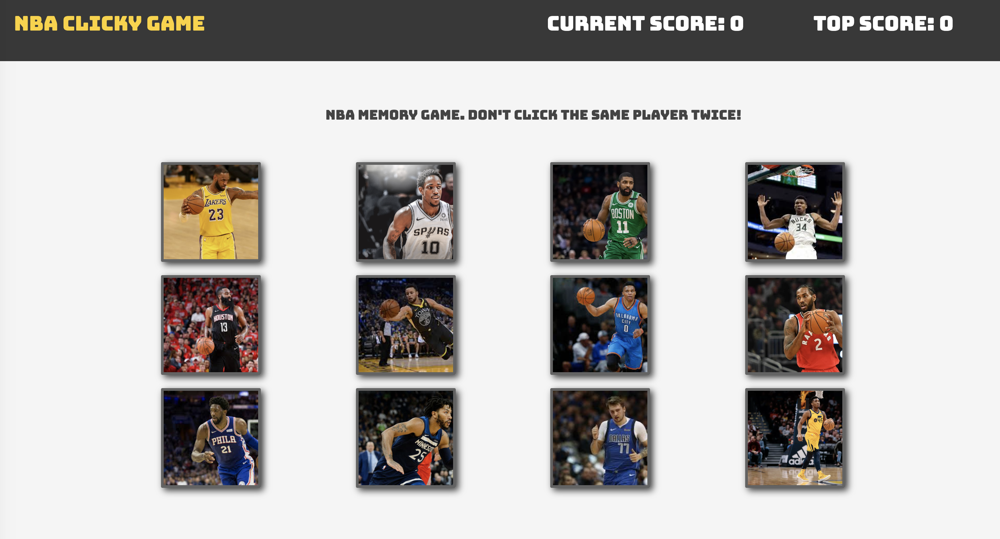

# react-game

## Overview

For this assignment, you'll create a memory game with React. This assignment will require you to break up your application's UI into components, manage component state, and respond to user events.

### Click on the pictures to get points but dont click the same one twice or else the points counter restarts.

